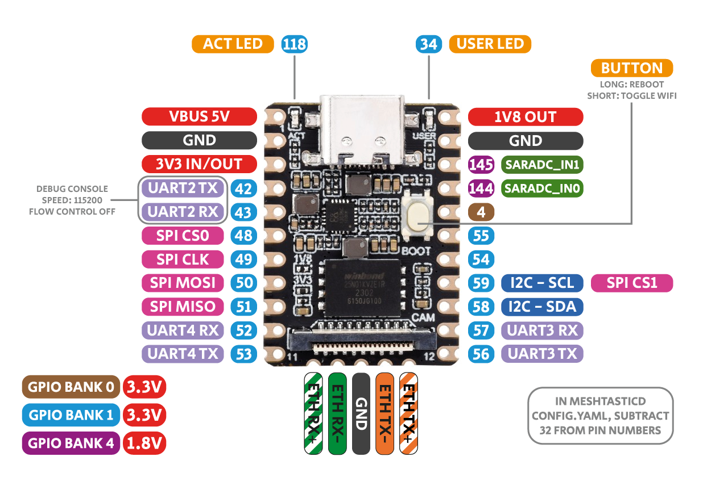

# Femtofox &nbsp;&nbsp;&nbsp;The tiny, low power Linux Meshtastic node
#### The Luckfox Pico Mini is a compact and power efficient Linux capable board, capable of running Ubuntu. Femtofox is an expansion of the Luckfox's capabilities, combining a customized Ubuntu image with a custom PCB, integrating it with a LoRa radio to create a power efficient, cheap and small Meshtastic Linux node.

 - Features
 - Supported hardware
 - Installation guide
 - How to order - coming soon
 - [Networking](#networking)
 - USB configuration tool 

**Features:**
* Tiny size (63x54mm for the Kitchen Sink Edition, 65x30mm for the Smol Edition). Roughly equivalent to a Raspberry Pi and Pi Zero.
* Power efficiency (~0.35-0.4w average with a 30db radio and no wifi)
* Full Linux CLI (Ubuntu) via our pre-built Foxbuntu image
* Meshtastic native client support via SPI
* USB host support
* USB wifi support
* RTC support for timekeeping

**Accomplished:**
- [x] Meshtastic native client controlling a LoRa radio (see [supported hardware](supported_hardware.md))
- [x] WIFI over USB (see [supported hardware](supported_hardware.md))
- [x] Ethernet over USB (see [supported hardware](supported_hardware.md))
- [x] Ethernet over pins (see *Networking* below and wiring diagram at bottom of page)
- [x] UART communications with Meshtastic nodes (2 pin pairs) such as RAK Wisblock
- [x] USB serial communications with Meshtastic nodes (see [supported hardware](supported_hardware.md))
- [x] USB mass storage
- [x] Real time clock (RTC) support (see [supported hardware](supported_hardware.md))
- [x] Activity LED disabled. User LED will blink for 5 seconds when boot is complete
- [x] Pressing the "BOOT" button triggers reboot
- [x] Ability to reconfigure wifi via USB flash drive
- [x] Meshtasticd to run LoRa radio over SPI (accomplished, updated image and instructions coming soon)
- [x] Allow editing of config files by plugging in thumb drive
- [x] Ability to activate or deactivate WIFI via Meshtastic admin

**Project goals:**
* A solar-deployable Meshtastic node running Linux, without needing a giant solar panel / battery
* Wifi capabilities (with ability to disable/enable wifi via mesh for power savings)

The preconfigured images will reboot every 24 hours. If the internal clock is accurate, this will be at 3am. Reboot timing is set in `crontab`. To keep accurate time, an RTC module can be installed (see [supported hardware](supported_hardware.md)) or internet connectivity can be utilized for NTP via [Chrony](https://chrony-project.org/).

### [Supported hardware - click here](supported_hardware.md)

### Networking
There are four methods to get online:
1. Ethernet over USB - most adapters should be supported, but I've only tested the RTL8152 chipset.
2. USB wifi  (see [supported hardware](supported_hardware.md)).
3. Preconfigured Ubuntu images: ethernet via the castellated pins at the bottom of the board. See pinout at the bottom of this readme.
4. RDNIS via usb - [see this guide](https://web.archive.org/web/20241006173648/https://wiki.luckfox.com/Luckfox-Pico/Luckfox-Pico-Network-Sharing-1/). Note that in the preconfigured images USB is set to host mode, so you'll have to switch back to peripheral with `sudo luckfox-config`. This is not really recommended, but can be used in a pinch.

### [Installation guide](foxbuntu_install.md)

### Pinout:
|Pin #|Pin ID |Function      |Luckfox |Pin #|Pin ID |Function      |
|-----|-------|--------------|--------|-----|-------|--------------|
|1    |VBus   |5V in/out     |        |22   |1V8    |1.8V out      |
|2    |GND    |              |        |21   |GND    |              |
|3    |3V3    |3.3V out      |        |20   |4C1    |1v8 IO, SARADC|
|4/42 |1B2    |Debug UART2-TX|        |19   |4C0    |1v8 IO, SARADC|
|5/43 |1B3    |Debug UART2-RX|        |18/4 |0A4    |3v3 IO        |
|6/48 |1C0    |CS0, IO       |        |17/55|1C7    |IRQ, IO       |
|7/49 |1C1    |CLK, IO       |        |16/54|1C6    |BUSY, IO      |
|8/50 |1C2    |MOSI, IO      |        |15/59|1D3    |i2c SCL       |
|9/51 |1C3    |MISO, IO      |        |14/58|1D2    |i2c SDA       |
|10/52|1C4    |UART4-TX      |        |13/57|1D1    |UART3-RX, NRST|
|11/53|1C5    |UART4-RX      |        |12/56|1D0    |UART3-TX, RXEN|

Pin ID explanation: **1C6** = GPIO bank **1**, group **C**, pin **6**.
In Meshtasticd's config.yaml we use GPIO bank 1, and subtract 32 from the pin number.

> [!NOTE]
> The information on this page is given without warranty or guarantee. Links to vendors of products are for informational purposes only.
> Meshtastic® is a registered trademark of Meshtastic LLC. Meshtastic software components are released under various licenses, see GitHub for details. No warranty is provided - use at your own risk.
