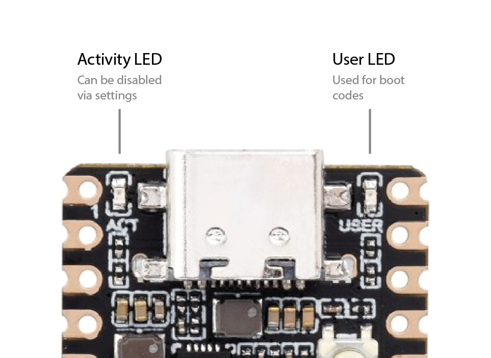

## USB Configuration Tool

To configure some Femtofox settings such as wifi, you can insert a USB flash drive containing a configuration file. On boot, the system will automatically recognize, mount and implement the settings you specify. The tool can also be run from the `femto-config` tool, in the `Utilities` menu.

Configurable settings are:

- Wifi SSID
- Wifi PSK (password)
- Wifi country
- Timezone
- Activity LED (blinky light - disable for minor power savings)
- Meshtastic:
  - LoRa radio model
  - [URL](https://meshtastic.org/docs/software/python/cli/#--seturl-seturl) (used to configure LoRa settings and channels)
  - Security: public key
  - Security: private key
  - Security: Add Admin Key
  - Security: Clear Admin Key List
  - Security: [Legacy Admin Channel](https://meshtastic.org/docs/configuration/radio/security/#admin-channel-enabled) enable/disable

### Instructions

The USB drive must be formatted with a single FAT32, exFAT, NTFS (read only - log will not be saved to drive) or ext4 partition. Add a file named `femtofox-config.txt` and whichever settings you would like to change (CaSe sEnSiTiVe).

    			<a href download="assets/femtofox-config.txt">[**Get an example USB configuration file here**](assets/femtofox-config.txt)</a>

```
wifi_ssid="Your SSID name"
wifi_psk="wifipassword"
wifi_country="US"
timezone="America/New_York"
act_led="enable"
meshtastic_lora_radio="ebyte-e22-900m30s"
meshtastic_url="https://meshtastic.org/e/#CgMSAQESCAgBOAFAA0gB"
#meshtastic_public_key="XX="
#meshtastic_private_key="XX="
meshtastic_admin_key="XX="
meshtastic_legacy_admin="true"
dont_run_if_log_exists="true"
```

> \[!NOTE\]
> Enter as many or as few settings as you like.
>
> For `wifi_country`, insert your country's [ISO/IEC alpha2 two letter country code](https://en.wikipedia.org/wiki/ISO_3166-1_alpha-2#Officially_assigned_code_elements) (such as US, GB, DE, IN, etc.) in capital letters.
>
> Use a timezone as it appears in [the tz database](https://en.wikipedia.org/wiki/List_of_tz_database_time_zones).
>
>   **Meshtastic**
> For `meshtastic_lora_radio`, choose your radio from the supported hardware list.
> Options are:
>
> - `ebyte-e22-900m30s`
> - `ebyte-e22-900m22s`
> - `ebyte-e80-900m22s` _(experimental)_
> - `heltec-ht-ra62`
> - `seeed-wio-sx1262`
> - `waveshare-sx126x-xxxm`
> - `ai-thinker-ra-01sh`
> - `sx1262_tcxo` _(for Ebyte E22-900M30SM, Ebyte E22-900M22S, Heltec HT-RA62, Seeed Wio SX1262)_
> - `sx1262_xtal` _(for AiThinker RA01SH, and Waveshare Pi hat)_
> - `lr1121_tcxo` _(experimental, for Ebyte E80-900M2213S)_
> - `none` _(for simulated radio)_
>
> Clearing the `meshtastic_admin_key` list: The admin key list can contain up to three keys - _if more are added they will be ignored_. The USB configuration tool supports clearing the admin key list, after which you will need to re-add your admin key/s in a second operation. To clear the admin key list, enter `meshtastic_admin_key="clear"`.

> \[!NOTE\]
> `dont_run_if_log_exists="true"` will prevent the USB configuration tool from working if there's a log present on the USB drive, indicating it has already been run. There is also an LED boot code for this, described below.

**To apply your configuration, reboot the Femtofox with the USB drive plugged in, or run `sudo femto-config` -&gt; `Utilites` -&gt; `Run USB configuration tool`. No other USB drives can be plugged in at the same time.**
A log (`femtofox-config.log`) is saved to `/home/femto` and the USB drive (except on NTFS, which is read only).
<br>

### Boot codes

When the Femtofox is finished booting, it will blink its User LED (see below) in a pattern which can be used to gather info on its status or help diagnose issues.



| LED blink pattern                                                                                                | Meaning                                                                                                                                                                                                     | Possible causes                                                                                                                                                                                                                                         | Solutions                                                                                                                                                                                            |
| ---------------------------------------------------------------------------------------------------------------- | ----------------------------------------------------------------------------------------------------------------------------------------------------------------------------------------------------------- | ------------------------------------------------------------------------------------------------------------------------------------------------------------------------------------------------------------------------------------------------------- | ---------------------------------------------------------------------------------------------------------------------------------------------------------------------------------------------------- |
| <center>⚠️<br>**________________**<br>1 very long blink, lasting 5 seconds                                         | Failed to mount USB drive. Ignoring.                                                                                                                                                                        | <li>Invalid filesystem<li>Corrupted partition table<li>Defective USB drive<li>Defective USB OTG adapter                                                                                                                                                 | <li>Use a supported partition (FAT32, exFAT, NTFS, ext4)<li>Repair partition table<li>Try another USB drive<li>Try another USB OTG adapter                                                           |
| <center>⚠️<br>**___  ___**<br>2 long blinks, each lasting 1.5 seconds                                        | femtofox-config.txt is configured to skip if log exists.                                                                                                                                                    | USB drive mounted successfully but femtofox-config.txt contains `dont_run_if_log_exists="true"` and a log is present on the USB drive. Ignoring.                                                                                                        | Remove log from USB drive or remove `dont_run_if_log_exists` line from femtofox-config.txt                                                                                                           |
| <center>⚠️<br>**___  ___  ___**<br>3 long blinks, each lasting 1.5 seconds                               | USB drive mounted successfully but femtofox-config.txt was not found. Ignoring.                                                                                                                             | Config file missing.                                                                                                                                                                                                                                    | Create configuration file as described above.                                                                                                                                                        |
| <center>⚠️<br>**____  ____  ____  ____  ____**<br>5 long blinks, each lasting 1.5 seconds             | USB drive mounted successfully and femtofox-config.txt was found but did not contain readable configuration data. Ignoring.                                                                                 | Configuration file improperly formatted or contains no data.                                                                                                                                                                                            | Check configuration file contents as described above.                                                                                                                                                |
| <center>⚠️<br>**___  ___  __  __**<br>2 long blinks, each lasting 1 second, then 2 short blinks, each lasting 1/4 of a second. Repeats twice | Error while trying to implement a Meshtastic setting after 3 attempts. Some settings may have been implemented successfully.                                                                                | <li>The error may be transient.<li>Configuration file may contain improper data.                                                                                                                                                                        | <li>Try again.<li>Check configuration file contents as described above.<li>Check the log.<br><br>This pattern may flash before other patterns. The pattern will repeat once for each failed setting. |
| <center>✅<br>**. . . . . . . . . .**<br>10 very fast blinks, each lasting 1/8th of a second                          | USB drive mounted successfully, and femtofox-config.txt was found and contained configuration data which was sent for deployment. Any affected services will now restart. You can disconnect the USB drive. | This does not mean that the information in the config file is correct - only that it was readable.<br>Note that the "success" boot code will flash if at least one setting is successfully read - even if the setting was not implemented successfully. |                                                                                                                                                                                                      |
| <center>✅<br>**___  ___  ___  ___  ___**<br>5 medium blinks, each lasting 0.5 seconds                           | Boot complete. Appears on every successful boot and always appears last.                                                                                                                                    |                                                                                                                                                                                                                                                         |                                                                                                                                                                                                      |

> \[!NOTE\]
> Boot codes can appear in sequence - for example: one long (4 second) blink, followed by 5 medium (half second) blinks means the USB drive failed to mount, and that the boot sequence is complete.

## USB Configuration Tool

To configure some Femtofox settings such as wifi, you can insert a USB flash drive containing a configuration file. On boot, the system will automatically recognize, mount and implement the settings you specify. The tool can also be run from the `femto-config` tool, in the `Utilities` menu.

Configurable settings are:

- Wifi SSID
- Wifi PSK (password)
- Wifi country
- Timezone
- Activity LED (blinky light - disable for minor power savings)
- Meshtastic:
  - LoRa radio model
  - [URL](https://meshtastic.org/docs/software/python/cli/#--seturl-seturl) (used to configure LoRa settings and channels)
  - Security: public key
  - Security: private key
  - Security: Add Admin Key
  - Security: Clear Admin Key List
  - Security: [Legacy Admin Channel](https://meshtastic.org/docs/configuration/radio/security/#admin-channel-enabled) enable/disable

### Instructions

The USB drive must be formatted with a single FAT32, exFAT, NTFS (read only - log will not be saved to drive) or ext4 partition. Add a file named `femtofox-config.txt` and whichever settings you would like to change (CaSe sEnSiTiVe).

    			<a href download="assets/femtofox-config.txt">[**Get an example USB configuration file here**](assets/femtofox-config.txt)</a>

```
wifi_ssid="Your SSID name"
wifi_psk="wifipassword"
wifi_country="US"
timezone="America/New_York"
act_led="enable"
meshtastic_lora_radio="ebyte-e22-900m30s"
meshtastic_url="https://meshtastic.org/e/#CgMSAQESCAgBOAFAA0gB"
#meshtastic_public_key="XX="
#meshtastic_private_key="XX="
meshtastic_admin_key="XX="
meshtastic_legacy_admin="true"
dont_run_if_log_exists="true"
```

> \[!NOTE\]
> Enter as many or as few settings as you like.
>
> For `wifi_country`, insert your country's [ISO/IEC alpha2 two letter country code](https://en.wikipedia.org/wiki/ISO_3166-1_alpha-2#Officially_assigned_code_elements) (such as US, GB, DE, IN, etc.) in capital letters.
>
> Use a timezone as it appears in [the tz database](https://en.wikipedia.org/wiki/List_of_tz_database_time_zones).
>
>   **Meshtastic**
> For `meshtastic_lora_radio`, choose your radio from the supported hardware list.
> Options are:
>
> - `ebyte-e22-900m30s`d
> - `ebyte-e22-900m22s`
> - `ebyte-e80-900m22s` _(experimental)_
> - `heltec-ht-ra62`
> - `seeed-wio-sx1262`
> - `waveshare-sx126x-xxxm`
> - `ai-thinker-ra-01sh`
> - `sx1262_tcxo` _(for Ebyte E22-900M30SM, Ebyte E22-900M22S, Heltec HT-RA62, Seeed Wio SX1262)_
> - `sx1262_xtal` _(for AiThinker RA01SH, and Waveshare Pi hat)_
> - `lr1121_tcxo` _(experimental, for Ebyte E80-900M2213S)_
> - `none` _(for simulated radio)_
>
> Clearing the `meshtastic_admin_key` list: The admin key list can contain up to three keys - _if more are added they will be ignored_. The USB configuration tool supports clearing the admin key list, after which you will need to re-add your admin key/s in a second operation. To clear the admin key list, enter `meshtastic_admin_key="clear"`.

> \[!NOTE\]
> `dont_run_if_log_exists="true"` will prevent the USB configuration tool from working if there's a log present on the USB drive, indicating it has already been run. There is also an LED boot code for this, described below.

**To apply your configuration, reboot the Femtofox with the USB drive plugged in, or run `sudo femto-config` -&gt; `Utilites` -&gt; `Run USB configuration tool`. No other USB drives can be plugged in at the same time.**
A log (`femtofox-config.log`) is saved to `/home/femto` and the USB drive (except on NTFS, which is read only).
<br>

### Boot codes

When the Femtofox is finished booting, it will blink its User LED (see below) in a pattern which can be used to gather info on its status or help diagnose issues.


| LED blink pattern                                                                                                                                                           | Meaning                                                                                                                                                                                                     | Possible causes                                                                                                                                                                                                                                         | Solutions                                                                                                                                                                                              |
| --------------------------------------------------------------------------------------------------------------------------------------------------------------------------- | ----------------------------------------------------------------------------------------------------------------------------------------------------------------------------------------------------------- | ------------------------------------------------------------------------------------------------------------------------------------------------------------------------------------------------------------------------------------------------------- | ------------------------------------------------------------------------------------------------------------------------------------------------------------------------------------------------------ |
| <center>⚠️<br>\_______________\_<br>1 very long blink, lasting 5 seconds</center>                                                                                           | Failed to mount USB drive. Ignoring.                                                                                                                                                                        | • Invalid filesystem<br>• Corrupted partition table<br>• Defective USB drive<br>• Defective USB OTG adapter                                                                                                                                             | • Use a supported partition (FAT32, exFAT, NTFS, ext4)<br>• Repair partition table<br>• Try another USB drive<br>• Try another USB OTG adapter                                                         |
| <center>⚠️<br>\_**_\_  \__**\_<br>2 long blinks, each lasting 1.5 seconds</center>                                                                                          | femtofox-config.txt is configured to skip if log exists.                                                                                                                                                    | USB drive mounted successfully but femtofox-config.txt contains `dont_run_if_log_exists="true"` and a log is present on the USB drive. Ignoring.                                                                                                        | Remove log from USB drive or remove `dont_run_if_log_exists` line from femtofox-config.txt                                                                                                             |
| <center>⚠️<br>\_**_\_  \__**\_  \____\_<br>3 long blinks, each lasting 1.5 seconds</center>                                                                                 | USB drive mounted successfully but femtofox-config.txt was not found. Ignoring.                                                                                                                             | Config file missing.                                                                                                                                                                                                                                    | Create configuration file as described above.                                                                                                                                                          |
| <center>⚠️<br>\_**_\_  \__**\_  \_**_\_  \__**\_  \____\_<br>5 long blinks, each lasting 1.5 seconds</center>                                                               | USB drive mounted successfully and femtofox-config.txt was found but did not contain readable configuration data. Ignoring.                                                                                 | Configuration file improperly formatted or contains no data.                                                                                                                                                                                            | Check configuration file contents as described above.                                                                                                                                                  |
| <center>⚠️<br>\__\_  \__\_  \_  \_  \__\_  \__\_  \_  \_<br>2 long blinks, each lasting 1 second, then 2 short blinks, each lasting 1/4 of a second. Repeats twice</center> | Error while trying to implement a Meshtastic setting after 3 attempts. Some settings may have been implemented successfully.                                                                                | • The error may be transient.<br>• Configuration file may contain improper data.                                                                                                                                                                        | • Try again.<br>• Check configuration file contents as described above.<br>• Check the log.<br><br>This pattern may flash before other patterns. The pattern will repeat once for each failed setting. |
| <center>✅<br>. . . . . . . . . .<br>10 very fast blinks, each lasting 1/8th of a second</center>                                                                            | USB drive mounted successfully, and femtofox-config.txt was found and contained configuration data which was sent for deployment. Any affected services will now restart. You can disconnect the USB drive. | This does not mean that the information in the config file is correct - only that it was readable.<br>Note that the "success" boot code will flash if at least one setting is successfully read - even if the setting was not implemented successfully. |                                                                                                                                                                                                        |
| <center>✅<br>\_\_  \_\_  \_\_  \_\_  \_\_<br>5 medium blinks, each lasting 0.5 seconds</center>                                                                             | Boot complete. Appears on every successful boot and always appears last.                                                                                                                                    |                                                                                                                                                                                                                                                         |                                                                                                                                                                                                        |

> \[!NOTE\]
> Boot codes can appear in sequence - for example: one long (4 second) blink, followed by 5 medium (half second) blinks means the USB drive failed to mount, and that the boot sequence is complete.
